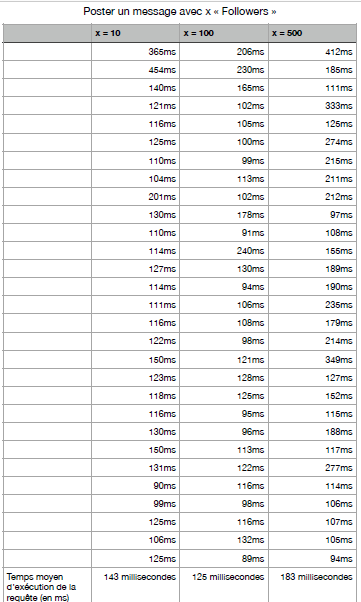
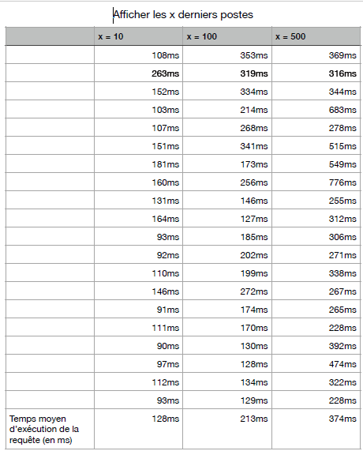
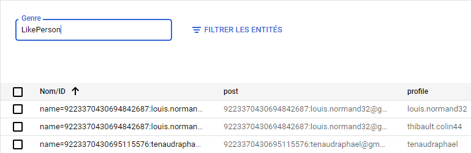
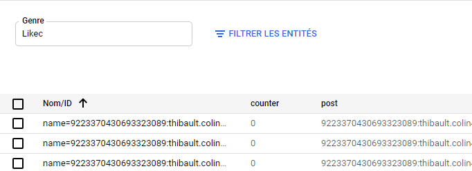
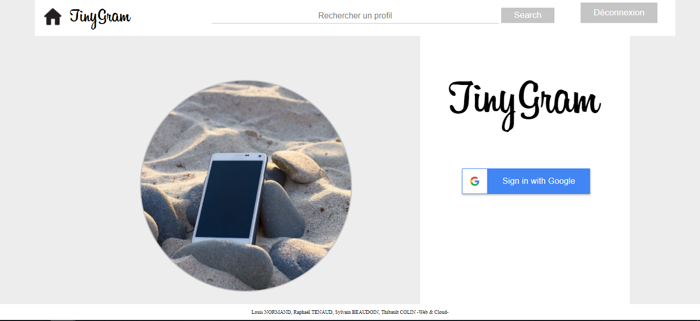
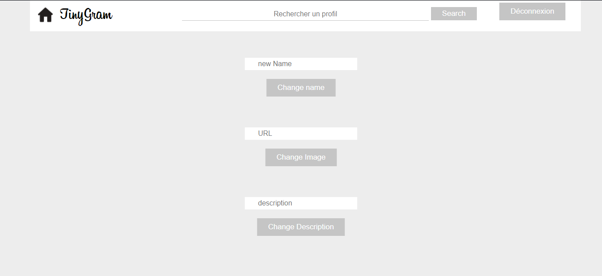
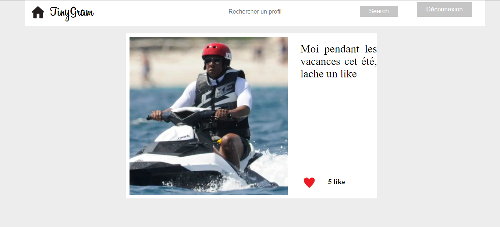

#TinyGram

## Présentation du projet
Ce projet TinyGram a été réalisé par 
[Raphaël TENAUD](https://github.com/Raph-glitch), 
[Louis NORMAND](https://github.com/LouisNmd), 
[Sylvain BEAUDOIN](https://github.com/ParadoxeDore), et 
[Thibault COLIN](https://github.com/Thibault-COLIN).
L'objectif du projet est de réaliser une application web qui rassemble les principales fonctionnalités 
d'Instagram comme poster des photos, suivre des profils ou encore liker des publications.
Ce projet a été réalisé en 2020 dans le cadre d'un cours de Web & Cloud and Datastore dispensé par 
[Pascal MOLLY](https://sites.google.com/view/pascal-molli/teaching/webcloud) à l'Université de Nantes.

## Liens utiles

* L'application TinyGram >> 
* [L'Api REST](https://endpointsportal.tinygram-1.cloud.goog/)
* [Le dépot Github](https://github.com/Raph-glitch/tinyGram)

## Contenu et Fonctionnalités
####Dans ce projet nous avons utilisé :
* [Google App Engine](https://cloud.google.com/appengine?hl=fr) pour concevoir et héberger notre application web basée sur les serveurs google.
* L'interface utilisateur a été réalisée en [mithril](https://mithril.js.org/)
* L'interface utilisateur fait des appels aux services REST écrits en Java sur le [Google Cloud EndPoint](https://cloud.google.com/endpoints/?hl=fr).
* Les services REST demandent et stockent des données dans le [Google Datastore](https://cloud.google.com/datastore/?hl=fr).

####A l'aide de ces outils nous avons pu implémenter les fonctionnalités suivantes :

* **Créer un compte sur l'application** grâce à Google sign-in.
* **Poster une photo sur son profil** avec ou sans description. 
* **Aimer un post** (et unlike un post).
* **Suivre un profil** ( et unfollow un profil).
* Suivre les post des personnes qu'on suit grâce à une **Timeline**.
* **Personnaliser son profil** changer sa photo,son nom, et sa description.
* **Rechercher un profil** grâce à une barre de recherche.

#### Améliorations possibles
* la Timeline prend 10 posts de chaque personne que l'on follow et les affiche
elle pourrait être améliorée pour qu'on puisse afficher 10 posts par défaut et load tous les posts 
plus de profils si on le souhaite.
* La barre de recherche n'est pas complète car nous devons pour l'instant mettre 
le nom complet du profil de quelqu'un pour chercher son profil, nous aimerions 
pouvoir suggérer les noms de profil qui se rapproche de la recherche que l'on fait.
* Les follows pourraient être enregistrés dans le Datastore sous forme de kind
 plutôt que sous forme de liste dans le kind profil.
* Le bouton follow ne notifie pas qu'on follow ou unfollow une personne lorsqu'on 
clique dessus. 
* Certains problèmes apparraissent parfois avec le bouton like au niveau du front-end.

##Benchmark
* ####Présentation des test effectués
Pour chacun des benchmarks suivants nous avons réalisé 
30 tests en fonction des variables que l'on voulait tester, 
par exemple en testant sur 10 utilisateurs puis sur 100 et enfin 500.
Ainsi on peut voir si l'exécution de ces requêtes scale.
* ####Benchmark : Poster un message à x "Followers"
Le temps pris pour ajouter un post avec toutes ses caractéristiques au profil et l'envoyer aux followers en fonction 
du nombre de followers de l'utilisateurs.

* ####Benchmark : Afficher les x derniers posts
Le temps pris pour afficher les posts sur la page profil d'une personne en fonction du nombre de 
posts à afficher. 

* ####Benchmark : Like d'un post
Nous n'avons pas réussi à faire le benchmark du like car on ne comprenait pas comment capturer le nombre de likes effectués 
par seconde :
* Faire des appels au like avec la même personne 500 fois ?
* Créer 500 profils pour liker le même post ?
* Comment récupérer ou calculer le temps que ça à pris ?

[insérer le benchmark des likes]: <>

##Conclusion
Pour finir sur ce projet nous sommes content d'avoir pu développer une application 
web concrète au cours de ce projet et d'avoir pu travailler sur tous les aspects du
développement d'une telle application.

Tous ces domaines à découvrir ou bien à utiliser et réunir en un ensemble furent très instructifs 
mais aussi très difficiles à mettre en place sans être guidé pour cette application. 

##Capture des kinds utilisés
####Kind Post
.PNG)
####Kind Profil (part1)
.PNG)
####Kind Profil (part2)
.PNG)
####Kind LikePerson

####Kind LikeCount

##Templates de présentation de l'application
####HomePage

####Profil Page
.PNG)
.PNG)
####Update Profil Page

####Timeline

